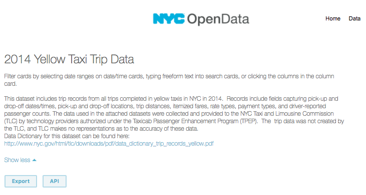

# Nearest Neighbors Lab

### Introduction

In this lab, you apply nearest neighbors technique to help a taxi company predict the length of their rides.  Imagine that we are hired to consult for LiftOff, a limo and taxi service that is just opening up in NYC.  Liftoff wants it's taxi drivers to target longer rides, as the longer the ride the more money it makes.  LiftOff has the following theory:

* the pickup location of a taxi ride can help predict the length of the ride.  


LiftOff asks us to do some analysis to write a function that will allow it to **predict the length of a taxi ride for any given location **.

Our technique will be the following:
  * **Collect** Obtain the data containing all of the taxi information, and only select the attributes of taxi trips that we need 
  * ** Explore ** Examine the attributes of our data, and plot some of our data on a map
  * ** Train ** Write our nearest neighbors formula, and change the number of nearby trips to predict the length of a new trip
  * ** Predict ** Use our function to predict trip lengths of new locations

### Collect and Explore the data

#### Collect the Data

Luckily for us, [NYC Open Data](https://opendata.cityofnewyork.us/) collects information about NYC taxi trips and provides this data on [its website](https://data.cityofnewyork.us/Transportation/2014-Yellow-Taxi-Trip-Data/gn7m-em8n).



For your reading pleasure, the data has already been downloaded into the [trips.json](https://github.com/learn-co-curriculum/nearest-neighbors-lab/blob/master/trips.json) file in this lab which you can find here.  We'll use Python's `json` library to take the data from the `trips.json` file and store it as a variable in our notebook.


```python
import json
# First, read the file
trips_file = open('trips.json')
# Then, convert contents to list of dictionaries 
trips = json.load(trips_file)
```

> Press shift + enter

#### Explore the data

The next step is to explore the data.  First, let's see how many trips we have.


```python
len(trips)
```

Not bad at all.  Now let's see what each individual trip looks like.  Each trip is a dictionary, so we can see the attributes of each trip with the `keys` function.


```python
trips[0].keys()
```

#### Limit our data

Ok, now that we have explored some of our data, let's begin to think through what data is relevant for our task.

Remember that our task is to **use the trip location to predict the length of a trip**.  So let's select the `pickup_latitude`, `pickup_longitude`, and `trip_distance` from each trip.  That will give us the trip location and related `trip_distance` for each trip.  Then based on these **actual** trip distances we can use nearest neighbors to predict an **expected** trip distance for a trip, provided an **actual** location.

** Add in about trip distance ** 

Write a function called `parse_trips(trips)` that returns a list of the trips with only the following attributes: 
* `trip_distance`
* `pickup_latitude`
* `pickup_longitude`


```python
def parse_trips(trips):
    pass
```


```python
parsed_trips = parse_trips(trips)
parsed_trips and parsed_trips[0]

# {'pickup_latitude': '40.64499',
#  'pickup_longitude': '-73.78115',
#  'trip_distance': '18.38'}
```

Now, there's just one change to make.  If you look at one of the trips, all of the values are strings.  Let's change them to be floats.


```python
def float_values(trips):    
    pass
```


```python
cleaned_trips = float_values(parsed_trips)
```


```python
cleaned_trips[0]

# {'pickup_latitude': 40.64499,
#  'pickup_longitude': -73.78115,
#  'trip_distance': 18.38}
```

### Exploring the Data

Now that we have paired down our data, let's get a sense of our trip data.  We can use the `folium` Python library to plot a map of Manhattan, and our data.  First we must import `folium`, and then use the `Map` function to pass through a `location`, and `zoom_start`.  If a map isn't showing up below, copy and paste the command `pip install -r requirements.txt` into your terminal to install `folium` then try again.


```python
import folium
manhattan_map = folium.Map(location=[40.7589, -73.9851], zoom_start=11)
```


```python
manhattan_map
```

Ok, now let's see how we could add a dot to mark a specific location.  We'll start with Times Square.


```python
marker = folium.CircleMarker(location = [40.7589, -73.9851], radius=10)
marker.add_to(manhattan_map)
```

Above, we first create a marker.  Then we add that circle marker to the `manhattan_map` we created earlier. 


```python
manhattan_map
```

Do you see that blue dot near Time's Square?  That is our marker.  

So now that we can plot one marker on a map, we should have a sense of how we can plot many markers on a map to display our taxi ride data.  We simply plot a map, and then we add a marker for each location of a taxi trip.

Now let's write some functions to allow us to plot maps and add markers a little more easily.  

#### Writing some map plotting functions

As a first step towards this, note that the functions to create both a marker and map each take in a location as two element list, representing the latitude and longitude values.  Take another look:

```python
marker = folium.CircleMarker(location = [40.7589, -73.9851])
manhattan_map = folium.Map(location=[40.7589, -73.9851])
```

So let's write a function called to create this two element list from a trip.  Write a function called `location` that  takes in a trip as an argument and returns a list where the first element is the latitude and the second is the longitude.  Remember that a location looks like the following:


```python
first_trip = {'pickup_latitude': 40.64499, 'pickup_longitude': -73.78115,  'trip_distance': 18.38}
first_trip
```


```python
def location(trip):
    pass
```


```python
first_location = location(first_trip) # [40.64499, -73.78115]
first_location # [40.64499, -73.78115]
```

Ok, now that we can turn a trip into a location, let's turn a location into a marker.  Write a function called `to_marker` that takes in a location (in the form of a list) as an argument, and returns a folium `circleMarker` for that location.  The radius of the marker should always equal 6.


```python
def to_marker(location):
    pass
```


```python
import json
times_square_marker = to_marker([40.7589, -73.9851])

times_square_marker and times_square_marker.location # [40.7589, -73.9851]
times_square_marker and json.loads(times_square_marker.options)['radius'] # 6
```

Ok, now that we know how to produce a single marker, let's write a function to produce lots.  We can write a function called `markers_from_trips` that takes in a list of trips, and returns a marker object for each trip.  


```python
def markers_from_trips(trips):
    pass
```


```python
trip_markers = markers_from_trips(cleaned_trips)
```


```python
cleaned_trips[0:4]
```


```python
trip_markers and len(trip_markers) # 1000

list(map(lambda marker: marker.location, trip_markers[0:4]))
# [[40.64499, -73.78115],
#  [40.766931, -73.982098],
#  [40.77773, -73.951902],
#  [40.795678, -73.971049]]
```

Ok, now that we have a function that creates locations, and a function that creates markers, it is time to write a function to plot a map. 

Write a function called `map_from` that, provided the first argument of a list location and second argument an integer representing the `zoom_start`, returns a `folium` map the corresponding location and `zoom_start` attributes.

> Hint: The following is how to write a map with folium:
> ```python 
    folium.Map(location=location, zoom_start=zoom_amount)
> ```


```python
def map_from(location, zoom_amount):
    pass
```


```python
times_square_map = map_from([40.7589, -73.9851], 15)
times_square_map and times_square_map.location # [40.7589, -73.9851]
times_square_map and times_square_map.zoom_start # 15
```


```python
times_square_marker and times_square_marker.add_to(times_square_map)
times_square_map
```

Now that we have a marker and a map, now let's write a function that adds a lot of markers to a map.  This function should add each marker in the list to the map object then return the updated map object.


```python
manhattan_map = map_from([40.7589, -73.9851], 13)
```


```python
def add_markers(markers, map_obj):
    pass
```


```python
map_with_markers = add_markers(trip_markers, manhattan_map)
```


```python
map_with_markers
```

### Using Nearest Neighbors

Ok, let's write a function that given a latitude and longitude will predict the distance for us.  We'll do this by first finding the nearest trips given a latitude and longitude. 

Here we once again apply the nearest neighbors formula. As a first step, write a function named `distance_location` that calculates the distance in pickup location between two trips.


```python
import math

def distance_location(selected_trip, neighbor_trip):
    pass
```


```python
first_trip = {'pickup_latitude': 40.64499, 'pickup_longitude': -73.78115, 'trip_distance': 18.38}
second_trip = {'pickup_latitude': 40.766931, 'pickup_longitude': -73.982098, 'trip_distance': 1.3}
distance_first_and_second = distance_location(first_trip, second_trip)

distance_first_and_second and round(distance_first_and_second, 3) # 0.235
```

Ok, next write a function called `distance_between_neighbors` that adds a new key-value pair, called `distance_from_selected`, that calculates the distance of the `neighbor_trip` from the `selected_trip`.


```python
def distance_between_neighbors(selected_trip, neighbor_trip):
    pass
```


```python
distance_between_neighbors(first_trip, second_trip)

# {'distance_from_selected': 0.23505256047318146,
#  'pickup_latitude': 40.766931,
#  'pickup_longitude': -73.982098,
#  'trip_distance': 1.3}
```

Ok, now our `neighbor_trip` has another attribute called `distance_from_selected`, that indicates the distance from the `neighbor_trip`'s pickup location from the `selected_trip`.

> ** Understand the data:** Our dictionary now has a few attributes, two of which say distance.  Let's make sure we understand the difference. 
> * **`distance_from_selected`:** This is our calculation of the distance of the neighbor's pickup location from the selected trip.
> * **`trip_distance`:** This is the attribute we were provided initially.  It tells us the length of the neighbor's taxi trip from pickup to drop-off.  

Next, write a function called `distance_all` that provided a list of neighbors, returns each of those neighbors with their respective `distance_from_selected` numbers.


```python
def distance_all(selected_individual, neighbors):
    pass
```


```python
cleaned_trips and distance_all(first_trip, cleaned_trips[0:4])
```

Now write the nearest neighbors formula to calculate the distance of the `selected_trip` from all of the `cleaned_trips` in our dataset.  If no number is provided, it should return the top 3 neighbors.


```python
def nearest_neighbors(selected_trip, trips, number = 3):
    pass
```


```python
new_trip = {'pickup_latitude': 40.64499,
'pickup_longitude': -73.78115,
'trip_distance': 18.38}

nearest_three_neighbors = nearest_neighbors(new_trip, cleaned_trips or [], number = 3)
nearest_three_neighbors
# [{'distance_from_selected': 0.0004569288784918792,
#   'pickup_latitude': 40.64483,
#   'pickup_longitude': -73.781578,
#   'trip_distance': 7.78},
#  {'distance_from_selected': 0.0011292165425673159,
#   'pickup_latitude': 40.644657,
#   'pickup_longitude': -73.782229,
#   'trip_distance': 12.7},
#  {'distance_from_selected': 0.0042359798158141185,
#   'pickup_latitude': 40.648509,
#   'pickup_longitude': -73.783508,
#   'trip_distance': 17.3}]
```

Ok great! Now that we can provide a new trip location, and find the distances of the three nearest trips, we can take  calculate an estimate of the trip distance for that new trip location.  

We do so simply by calculating the average of it's nearest neighbors.


```python
import statistics
def mean_distance(neighbors):
    nearest_distances = list(map(lambda neighbor: neighbor['trip_distance'], neighbors))
    return round(statistics.mean(nearest_distances), 3)

nearest_three_neighbors = nearest_neighbors(new_trip, cleaned_trips or [], number = 3)
distance_estimate_of_selected_trip = mean_distance(nearest_three_neighbors) # 12.593
distance_estimate_of_selected_trip
```

### Choosing the correct number of neighbors

Now, as we know from the last lesson, one tricky element is to determine how many neighbors to choose, our $k$ value,  before calculating the average.  We want to choose our value of $k$ such that it properly matches actual data, and so that it applies to new data.  There are fancy formulas to ensure that we **train** our algorithm so that our formula is optimized for all data, but here let's see different $k$ values manually.  This is the gist of choosing our $k$ value:

* If we choose a $k$ value too low, our formula will be too heavily influenced by a single neighbor, whereas if our $k$ value is too high, we will be choosing so many neighbors that our nearest neighbors formula will not be adjust enough according to locations.

Ok, let's experiment with this.

First, let's choose a midtown location, to see what the trip distance would be.  A Google search reveals the coordinates of 51st and 7th avenue to be the following.


```python
midtown_trip = dict(pickup_latitude=40.761710, pickup_longitude=-73.982760)
```


```python
seven_closest = nearest_neighbors(midtown_trip, cleaned_trips, number = 7)
seven_closest
# [{'trip_distance': 0.58,
#   'pickup_latitude': 40.761372,
#   'pickup_longitude': -73.982602,
#   'distance_from_selected': 0.00037310588309379025},
#  {'trip_distance': 0.8,
#   'pickup_latitude': 40.762444,
#   'pickup_longitude': -73.98244,
#   'distance_from_selected': 0.00080072217404248},
#  {'trip_distance': 1.4,
#   'pickup_latitude': 40.762767,
#   'pickup_longitude': -73.982293,
#   'distance_from_selected': 0.0011555682584735844},
#  {'trip_distance': 8.3,
#   'pickup_latitude': 40.762868,
#   'pickup_longitude': -73.983233,
#   'distance_from_selected': 0.0012508768924205918},
#  {'trip_distance': 1.26,
#   'pickup_latitude': 40.760057,
#   'pickup_longitude': -73.983502,
#   'distance_from_selected': 0.0018118976240381972},
#  {'trip_distance': 0.0,
#   'pickup_latitude': 40.760644,
#   'pickup_longitude': -73.984531,
#   'distance_from_selected': 0.002067074502774709},
#  {'trip_distance': 1.72,
#   'pickup_latitude': 40.762107,
#   'pickup_longitude': -73.98479,
#   'distance_from_selected': 0.0020684557041472677}]
```

Looking at the `distance_from_selected` it appears that our our trips are still fairly close to our selected trip.  Notice that most of the data is within a distance of .002 away, so going to the top 7 nearest neighbors didn't seem to give us neighbors too far from each other, which is a good sign.

Still, it's hard to know what distance in latitude and longitude really look like, so let's map the data. 


```python
midtown_location = location(midtown_trip) # [40.76171, -73.98276]
midtown_map = map_from(midtown_location, 16)
closest_markers = markers_from_trips(seven_closest)

add_markers(closest_markers, midtown_map)
```

Ok.  These locations stay fairly close to our estimated location of 51st street and 7th Avenue.  So they could be a good estimate of a trip distance.


```python
mean_distance(seven_closest) # 2.009
```

Ok, now let's try a different location


```python
charging_bull_closest = nearest_neighbors({'pickup_latitude': 40.7049, 'pickup_longitude': -74.0137}, cleaned_trips, number = 12)
```


```python
mean_distance(charging_bull_closest) # 3.145
```

Ok, so there appears to be a significant difference between choosing a location near Times Square versus choosing a location at Wall Street.

### Summary

In this lab, we used the nearest neighbors function to predict the length of a taxi ride.  To do so, we selected a location, then found a number of taxi rides closest to that location, and finally took the average trip lengths of the nearest taxi rides to find an estimate of the new ride's trip length.  You can see that even with just a little bit of math and programming we can begin to make meaningful predictions with data.
