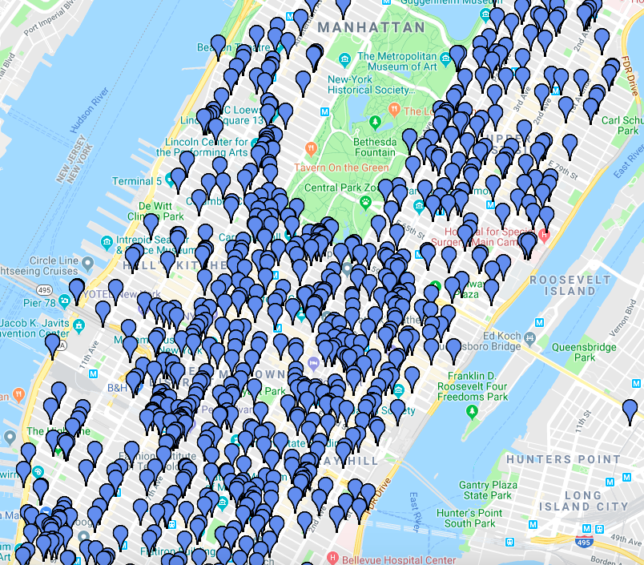
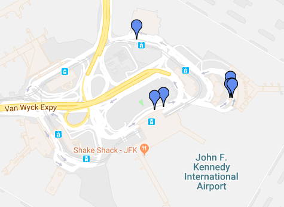
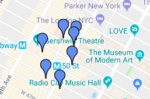

# Nearest Neighbors Lab

### Introduction

In this lab, you apply nearest neighbors technique to help a taxi company predict the length of their rides.  Imagine that we are hired to consult for LiftOff, a limo and taxi service that is just opening up.  It wants to do some initial research on NYC trips.  LiftOff has a theory that the pickup location of a taxi ride can help predict the length of the ride.  So the hypothesis is that trips that have a similar pickup location will have a similar trip length. It wants to target the locations that generally have longer rides, as it makes more money that way.

LiftOff asks us to do some analysis. Lucky for us, information about NYC taxi trips is available on [it's website](https://data.cityofnewyork.us/Transportation/2014-Yellow-Taxi-Trip-Data/gn7m-em8n).  

### A little different

Before we get started, note that our problem here is a little bit different than what we worked with previously.  

Before our job would be complete upon finding the closest trips to a given location -- that is, upon finding our nearest neighbors.  Now, we still need to find the closest trips, but then we also need to use this data to predict the length of the trip.  As you'll see, to predict a trip length from a given location, we'll find the trips that occurred nearest to the given location, then take the median of those nearest trips, to make a prediction about trip length.

The second new thing that we'll see with our problem is the task of choosing the correct number of neighbors or trips.  Say we choose the 500 closest neighbors to a given point.  Well in a dataset of only 1000 trips, we would be including trips from all over the map, and our nearest neighbors formula wouldn't tell us too much about how a specific point is different.  However, if we only choose one neighbor at a given point and assume that the one neighbor's trip distance predicts the length of our trip, then we run the risk of that trip just being a special case and not the norm for that area.  So how to choose the correct number of neighbors, referred to as $k$, is something that we'll need to explore.   

### Exploring and Gathering the Data

If you go to [NYC Open Data](https://opendata.cityofnewyork.us/), you can find NYC taxi data after a quick search [it's website](https://data.cityofnewyork.us/Transportation/2014-Yellow-Taxi-Trip-Data/gn7m-em8n) if you click on the button, "API", you'll find the data that we'll be working with.  For you're reading pleasure, the data has already been moved to the "trips.json" file in this lab.

```python
[
  {
    "dropoff_datetime": "2014-11-26T22:31:00.000",
    "dropoff_latitude": "40.746769999999998",
    "dropoff_longitude": "-73.997450000000001",
    "fare_amount": "52",
    "imp_surcharge": "0",
    "mta_tax": "0.5",
    "passenger_count": "1",
    "payment_type": "CSH",
    "pickup_datetime": "2014-11-26T21:59:00.000",
    "pickup_latitude": "40.64499",
    "pickup_longitude": "-73.781149999999997",
    "rate_code": "2",
    "tip_amount": "0",
    "tolls_amount": "5.3300000000000001",
    "total_amount": "57.829999999999998",
    "trip_distance": "18.379999999999999",
    "vendor_id": "VTS"
  },
...
...
]
```

### Document Retrieval 

Now, we like the amount of data, but we don't need all of the attributes provided.  We decide that all we need for this exploration is `pickup_latitude`, and `pickup_longitude`.

The first step is to load the data from a JSON file, which can be a little tricky in python.  We'll write a function to do it for you - using the pandas library. 


```python
import pandas

def parse_file(fileName):
    trips_df = pandas.read_json(fileName)
    return trips_df.to_dict('records')

trips = parse_file('trips.json')
```


```python
trips[0]
```


    {'dropoff_datetime': '2014-11-26T22:31:00.000',
     'dropoff_latitude': 40.74677,
     'dropoff_longitude': -73.99745,
     'fare_amount': 52.0,
     'imp_surcharge': 0.0,
     'mta_tax': 0.5,
     'passenger_count': 1,
     'payment_type': 'CSH',
     'pickup_datetime': '2014-11-26T21:59:00.000',
     'pickup_latitude': 40.64499,
     'pickup_longitude': -73.78115,
     'rate_code': 2,
     'store_and_fwd_flag': nan,
     'tip_amount': 0.0,
     'tolls_amount': 5.33,
     'total_amount': 57.83,
     'trip_distance': 18.38,
     'vendor_id': 'VTS'}


```python
len(trips)
```


    1000


Ok, so as you can see from above, the `trips` variable returns an array of dictionaries with each dictionary representing a trip.  Write a function called `parse_trips(trips)` that returns an array of the trips with just the following attributes: `trip_distance`, `pickup_latitude`, `pickup_longitude`.  

Run the `index-tests.py` file to ensure that you wrote it correctly.


```python
def parse_trips(trips):
    return 2
```


```python
parsed_trips = parse_trips(trips)
# parsed_trips[0]
    # {'pickup_latitude': 40.64499,
    #  'pickup_longitude': -73.78115,
    #  'trip_distance': 18.38}

# len(parsed_trips)
    # 1000


# set([key for trip in parsed_trips for key in list(trip.keys())])
    # {'pickup_latitude', 'pickup_longitude', 'trip_distance'}
```

### Exploring the Data

Now that we have paired down our data, let's answer some initial questions.  Here is where our data will go. 


```python
import gmplot
gmap = gmplot.GoogleMapPlotter(40.758896, -73.985130, 12)
gmap.draw("mymap.html")
```


Now, plotting the data feeds into the following function.
```python
gmap.plot(latitudes, longitudes, 'cornflowerblue', edge_width=10)
```
So we'll need an array of latitudes, each element representing the latitude of a trip, and an array of longitudes, each representing the longitudes associted with a trip.  Write a function called `trip_latitudes` that given a list of trips returns a list of latitudes, and `trip_longitudes` that given a list of trips, returns a list of `longitudes` accordingly.  Run the file `nearest-neighbor-lab-tests.py` to get feedback.  


```python
def trip_latitudes(trips):
    pass
```


```python
def trip_longitudes(trips):
    pass
```


```python
latitudes = trip_latitudes(parsed_trips)
longitudes = trip_longitudes(parsed_trips)
```


```python
# len(latitudes) 
# 1000
```


```python
gmap.plot(latitudes or [], longitudes or [], 'cornflowerblue', edge_width=10)
gmap.draw("myplot.html")
```

Plotting the trips give you the following.



### Using Nearest Neighbors

Ok, let's write a function that given a latitude and longitude will predict the fare distance for us.  We'll do this by first finding the nearest trips given a latitude and longitude. 

 First write a method `distance_location` that calculates the distance between two individuals.


```python
import math

def distance_location(selected_individual, neighbor):
    pass
```


```python
# first_trip = parsed_trips[0]
# second_trip = parsed_trips[1]

# distance_location(first_trip, second_trip) 
    # 0.23505256047318146
```

Write the nearest neighbors formula.  If no number is provided, it should return the top 3 neighbors.


```python
def nearest_neighbors(selected_individual, neighbors, number = 3):
    pass
```


```python
selected_trip = {'pickup_latitude': 40.64499,
'pickup_longitude': -73.78115,
'trip_distance': 18.38}


nearest_neighbors(selected_trip, parsed_trips or [], number = 3)

# [{'distance': 0.0004569288784918792,
#   'pickup_latitude': 40.64483,
#   'pickup_longitude': -73.781578,
#   'trip_distance': 7.78},
#  {'distance': 0.0011292165425673159,
#   'pickup_latitude': 40.644657,
#   'pickup_longitude': -73.782229,
#   'trip_distance': 12.7},
#  {'distance': 0.0042359798158141185,
#   'pickup_latitude': 40.648509,
#   'pickup_longitude': -73.783508,
#   'trip_distance': 17.3}]
```

### Choosing the correct number of neighbors

Now in working with a nearest neighbors formula, one tricky question is how many neighbors we should use.  Remember that our guess is that trips that have similar pickup locations will have similar lengths of trips.  Then we will just take the median of the trip lengths of this group together to make a prediction.  

If we choose too many neighbors, then we'll be averaging together distances from all over town, and we won't really be differentiating between locations.  But if we  look at the trip distances of the three neighbors above, this may be small.  Take a look at the `trip_distances` of the 3 neighbors above.  It's hard to tell if the trip distance of 7 is more typical than the distance of 17.  In other words, our sample size is small.

The choice of the correct number of neighbors is called choosing the correct $k$, as that the variable often assigned to the number of neighbors.  We'll experiment with the our $k$ size throughout the rest of this lab.

Let's increase the number of our neighbors to see what happens. 


```python
seven_closest = nearest_neighbors(selected_trip, parsed_trips or [], number = 7)
seven_closest
```

Notice that most of the data is a distance of .0045 away, so going to the top 7 nearest neighbors didn't seem to give us neighbors too far from each other, which is a good sign.  Still, it's hard to know what distance in latitude and longitude really look like, so let's try mapping the data.  


```python
# seven_lats = trip_latitudes(seven_closest)
# seven_longs = trip_longitudes(seven_closest)
```


```python
# gmap = gmplot.GoogleMapPlotter(first_trip['pickup_latitude'], first_trip['pickup_longitude'], 15)
# gmap.scatter(seven_lats, seven_longs, 'cornflowerblue', edge_width=10)
# gmap.draw("nearestneighbors.html")
```



Well, it looks like we can't really make an assessment of a good $k$ size with this data.  Our location is the airport, which is probably not a very typical place to see if our $k$ size is good for predicting trip lengths.

Let's choose another spot that we expect to be less atypical.  Fifty-first street and 7th Avenue is at $40.761710, -73.982760$.  Now let's again try to see if seven locations is a good spread, but this time starting from midtown.


```python
# midtown_loc = {'pickup_latitude': 40.761710, 'pickup_longitude': -73.982760}
# midtown_neighbors = nearest_neighbors(midtown_loc, parsed_trips, number = 7)
# list(map(lambda trip: trip['distance'], midtown_neighbors))
```

The distances between neighbors double in size as our $k$ goes from four to five.  How far is this distance really?


```python
# gmap = gmplot.GoogleMapPlotter(midtown_loc['pickup_latitude'], midtown_loc['pickup_longitude'], 15)
# closest_lats = trip_latitudes(midtown_neighbors)
# closest_longs = trip_longitudes(midtown_neighbors)

# gmap.scatter(closest_lats, closest_longs, 'cornflowerblue', edge_width=10)
# gmap.draw("nearestmidtown.html")
```



So essentially this is one or two blocks away from our location of 51st and 7th.  Not too bad.  Looking at the length of the trip for our seven it seems like our neighbor size, $k$, is large enough so we can start to see what would be an expected trip distance.


```python
# midtown_neighbors
```

### Calculating an expected trip distance

Another way of thinking about the number of neighbors we should choose, is to think the deviation from the median distance.  We want to make sure our number is not so large so that when we choose a location, it just looks like the expected distance across all taxi trips in Manhattan. 

Let's write a function called `median_of` that takes a list of trips, and returns the median `trip_distance`.


```python
import statistics
def median_of(neighbors):
    pass
```


```python
median_of(parsed_trips or [])
```

So when we compare this with our `midtown_neighbors`, we can see that the number is different.  So our number of neighbors is not so large so that we look like the median.


```python
# median_of(midtown_neighbors)
```

Still, if we begin to change the number of neighbors from seven to ten, our median really starts to change.


```python
# median_of(nearest_neighbors(midtown_loc, parsed_trips, number = 10))
```

Notice however, that between 15 to 20, to 25, our formula begins to give us a similar result.  


```python
# median_of(nearest_neighbors(midtown_loc, parsed_trips, number = 25))
```

So it appears that around 20 could be a sweet spot. Let's try another location to see how we do.


```python
# uws_loc = {'pickup_latitude': 40.786430, 'pickup_longitude': -73.975979}
```


```python
# median_of(nearest_neighbors(uws_loc, parsed_trips, number = 20))
```


```python
# downtown_loc = {'pickup_latitude': 40.713186, 'pickup_longitude': -74.007243}
```


```python
# median_of(nearest_neighbors(downtown_loc, parsed_trips, number = 20))
```

### Summary

Alright, at this point we should be pretty happy as we can make a recommendation to LiftOff.  We can tell LiftOff the neighborhoods in Manhattan that will have the largest expected distance.
